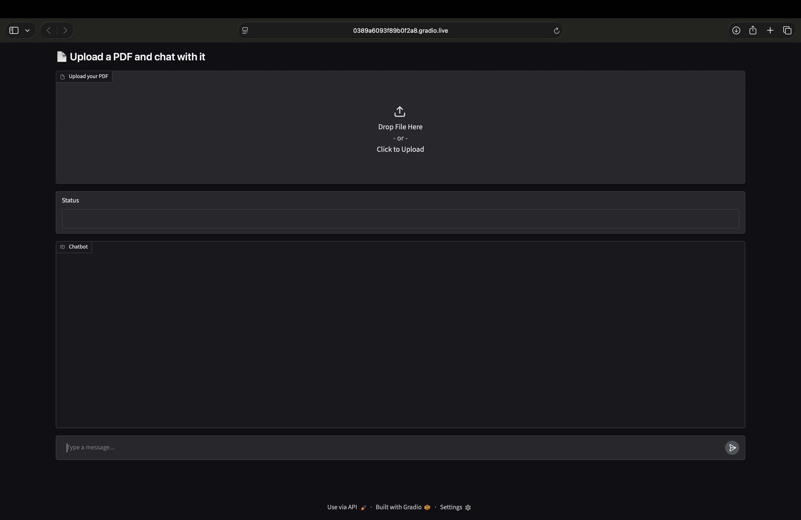
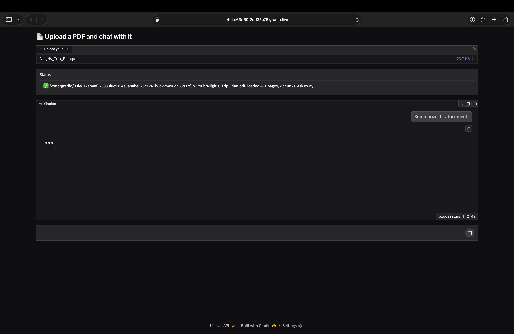
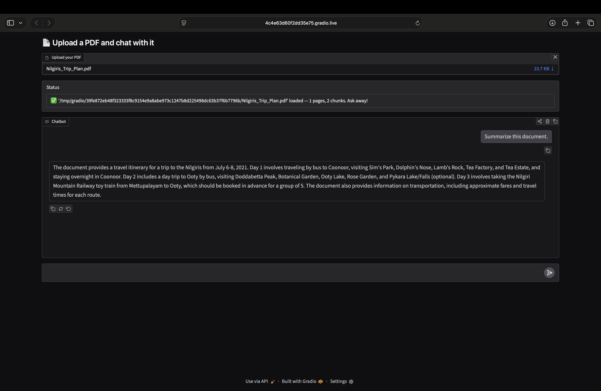

<div align="center">

# 📄 AI PDF Chatbot

### 🤖 Chat with PDF Documents using Retrieval-Augmented Generation (RAG)

<p align="center">

An intelligent PDF Question Answering application powered by a custom <b>Retrieval-Augmented Generation (RAG)</b> pipeline.

Upload any PDF document, ask questions in natural language, and receive context-aware answers generated by <b>Zephyr-7B-Beta</b> using semantic search over your document.

</p>

<br>

<p align="center">


</p>

<br>

[](https://colab.research.google.com/drive/1TizA3xUFFRVJ-fIv-GqbQGLGwpjJ8RZG?usp=sharing)

</div>

---

# 🌟 Overview

Large Language Models are powerful, but they cannot answer questions about documents they have never seen.

This project solves that problem using **Retrieval-Augmented Generation (RAG)**.

Instead of relying only on pretrained knowledge, the application first retrieves the most relevant information from an uploaded PDF and then generates a response grounded in that context.

The application combines semantic search, dense vector embeddings, and a quantized large language model to create a lightweight yet powerful document assistant that can understand reports, notes, research papers, manuals, and books.

---

# 🎯 Motivation

Searching through large PDF documents manually is time-consuming.

This chatbot makes document exploration conversational.

Instead of scrolling through hundreds of pages, users can simply ask questions such as:

- 📚 "Summarize this research paper."
- 📄 "What are the main findings?"
- 📑 "Explain Chapter 5."
- 📖 "Where is this topic discussed?"
- 📝 "List the important formulas."

The model retrieves only the most relevant sections before generating an answer, improving both relevance and factual accuracy.

---

# ✨ Features

- 📄 Upload PDF documents
- 🤖 Conversational Question Answering
- 🔍 Semantic Search using ChromaDB
- 🧠 Context-aware response generation
- 📚 Automatic PDF text extraction
- ✂️ Intelligent text chunking
- 📄 Page-aware citations
- 🔢 SentenceTransformer embeddings
- ⚡ Quantized Zephyr-7B inference (4-bit)
- 🎨 Interactive Gradio interface
- 🔄 Session-based vector collections
- ☁️ Runs entirely in Google Colab

---

# 📸 Demo

## 📤 Upload PDF

<p align="center">

</p>

---

## 💬 Ask Questions

<p align="center">

</p>

---

## ✅ AI Response

<p align="center">

</p>

---

# 📑 Table of Contents

- 🌟 Overview
- 🎯 Motivation
- ✨ Features
- 📸 Demo
- 🛠️ Tech Stack
- 🏗️ Architecture
- 🔄 RAG Pipeline
- ⚙️ Installation
- 🚀 Usage
- 📂 Project Structure
- 💡 Example Queries
- 📊 Implementation Details
- ⚠️ Limitations
- 🗺️ Future Improvements
- 🤝 Contributing
- 📜 License
- 🙌 Acknowledgements

---# 🛠️ Tech Stack

| Category | Technology |
|----------|------------|
| Programming Language | Python |
| Large Language Model | HuggingFaceH4/zephyr-7b-beta |
| Embedding Model | sentence-transformers/all-MiniLM-L6-v2 |
| Vector Database | ChromaDB |
| PDF Processing | PyPDF2 |
| Deep Learning | PyTorch |
| Transformers | Hugging Face Transformers |
| Quantization | BitsAndBytes (4-bit) |
| User Interface | Gradio |
| Notebook Environment | Google Colab |

---

# 🏗️ System Architecture

```text
                    +---------------------+
                    |     PDF Upload      |
                    +----------+----------+
                               |
                               v
                    +---------------------+
                    |      PyPDF2         |
                    |  Extract Text/Page  |
                    +----------+----------+
                               |
                               v
                    +---------------------+
                    |  Text Chunking      |
                    | (200 / overlap 40)  |
                    +----------+----------+
                               |
                               v
             +------------------------------------+
             | Sentence Transformer Embeddings    |
             | all-MiniLM-L6-v2                   |
             +----------------+-------------------+
                              |
                              v
                   +--------------------------+
                   |       ChromaDB           |
                   |  Vector Store & Search   |
                   +------------+-------------+
                                |
                      User Question
                                |
                                v
                   +--------------------------+
                   | Semantic Retrieval       |
                   | Top Relevant Chunks      |
                   +------------+-------------+
                                |
                                v
                +-------------------------------+
                | Zephyr-7B-Beta (4-bit)        |
                | Response Generation           |
                +---------------+---------------+
                                |
                                v
                      Answer + Page References
```

---

# 🔄 RAG Pipeline

The chatbot follows a Retrieval-Augmented Generation workflow:

### 1️⃣ Upload PDF

The user uploads any PDF document through the Gradio interface.

↓

### 2️⃣ Text Extraction

The PDF is parsed using **PyPDF2**, extracting text page by page.

↓

### 3️⃣ Chunk Creation

The extracted text is divided into smaller overlapping chunks.

- Chunk Size: **200 characters**
- Overlap: **40 characters**

Overlapping chunks preserve context between adjacent sections.

↓

### 4️⃣ Embedding Generation

Each chunk is converted into a dense vector representation using:

> **sentence-transformers/all-MiniLM-L6-v2**

↓

### 5️⃣ Vector Storage

The embeddings are stored inside a **ChromaDB** collection for efficient similarity search.

↓

### 6️⃣ Semantic Retrieval

When the user asks a question:

- The query is embedded.
- Similar vectors are retrieved.
- Only the most relevant document chunks are selected.

↓

### 7️⃣ Context-Aware Generation

The retrieved chunks are provided as context to:

> **HuggingFaceH4/zephyr-7b-beta**

The model generates an answer grounded in the retrieved document instead of relying solely on its pretrained knowledge.

↓

### 8️⃣ Final Response

The chatbot returns:

- Accurate answer
- Context-aware explanation
- Relevant page numbers (when available)

---

# ⚙️ Installation

## Clone the repository

```bash
git clone (https://github.com/fifthdivisionghost/AI-PDF-Chatbot.git)
cd AI-PDF-Chatbot
```

---

## Install dependencies

```bash
pip install -r requirements.txt
```

---

## Launch the notebook

Open the notebook in:

- Google Colab

or

- Jupyter Notebook

Run every cell sequentially.

---

# 🚀 Usage

### Step 1

Launch the notebook.

### Step 2

Wait for all models to load.

### Step 3

Open the generated Gradio interface.

### Step 4

Upload a PDF document.

### Step 5

Wait while the application:

- extracts text
- creates chunks
- generates embeddings
- indexes the document

### Step 6

Ask questions naturally.

Example:

> What are the main conclusions?

or

> Explain Chapter 4.

or

> Summarize the entire document.

The chatbot retrieves the most relevant context before generating an answer.

---

# 📂 Project Structure

```
AI-PDF-Chatbot/
│
├── AI_pdf_chatbot.ipynb
├── README.md
├── LICENSE
├── requirements.txt
│
├── assets/
│   ├── upload.png
│   ├── chat.png
│   └── response.png
│
└── sample.pdf
```

---

# 🧩 Core Components

## 📄 PDF Processing

- PyPDF2
- Page-wise text extraction
- Automatic parsing

---

## ✂️ Text Chunking

- Fixed-size chunks
- Overlapping windows
- Better retrieval quality

---

## 🔢 Embedding Generation

Model:

```
sentence-transformers/all-MiniLM-L6-v2
```

Used to transform both:

- document chunks
- user queries

into semantic vector representations.

---

## 🗄️ Vector Database

ChromaDB stores embeddings and performs fast semantic similarity search.

Each uploaded document receives its own session-based collection for isolation.

---

## 🤖 Response Generation

Model:

```
HuggingFaceH4/zephyr-7b-beta
```

Loaded using **4-bit quantization** to reduce memory usage while maintaining strong inference performance.

---

## 🎨 User Interface

Built with **Gradio**.

The application provides an intuitive conversational interface where users can upload PDFs and interact with them in real time.

---# 💡 Example Questions

Here are a few example prompts you can ask after uploading a PDF:

### 📚 General Understanding

- Summarize this document.
- What is the purpose of this paper?
- Explain this report in simple terms.
- What are the key findings?

---

### 📄 Document Navigation

- Which page discusses neural networks?
- Where is the conclusion?
- Which chapter explains gradient descent?
- Show me the important sections.

---

### 🧠 Deep Understanding

- Explain this concept with examples.
- Compare the two methods discussed.
- List the advantages and disadvantages.
- What assumptions does the author make?

---

### 📊 Research Papers

- What methodology was used?
- Summarize the experimental results.
- Explain the proposed architecture.
- What future work is suggested?

---

# ⚙️ Implementation Highlights

Unlike traditional PDF readers, this project performs semantic retrieval before generating an answer.

### 📄 Intelligent Text Chunking

Documents are automatically split into overlapping chunks to preserve context across consecutive sections.

---

### 🔎 Semantic Search

Instead of keyword matching, user queries are embedded into vectors and compared with document embeddings using cosine similarity in ChromaDB.

This allows the chatbot to understand meaning rather than exact wording.

---

### 📚 Page-Aware Retrieval

Each text chunk stores its corresponding page number.

The generated response can reference the page(s) where the supporting information was found, making answers easier to verify.

---

### 🗂️ Session-Based Collections

Every uploaded document is stored in its own ChromaDB collection using a unique session identifier.

This keeps conversations isolated and prevents data from different PDFs from mixing.

---

### ⚡ Efficient Inference

The Zephyr-7B model is loaded using **4-bit quantization** through BitsAndBytes, significantly reducing GPU memory usage while maintaining strong generation quality.

---

### 🎯 Grounded Responses

Instead of relying only on pretrained knowledge, the model answers using retrieved document context, reducing hallucinations and improving factual accuracy.

---

# 📈 Why Retrieval-Augmented Generation (RAG)?

Traditional Large Language Models cannot access information contained inside documents uploaded after training.

Retrieval-Augmented Generation solves this problem by combining semantic search with language generation.

### Benefits

- ✅ Better factual accuracy
- ✅ Reduced hallucinations
- ✅ Context-aware responses
- ✅ Works with private documents
- ✅ No model fine-tuning required
- ✅ Scalable to large document collections

---

# ⚠️ Current Limitations

- Supports PDF documents only.
- Performance depends on the quality of extracted text.
- Image-based or scanned PDFs require OCR before processing.
- Very large PDFs may take longer to index.
- Responses are limited to the information contained within the uploaded document.

---

# 🗺️ Future Improvements

- 📂 Support multiple PDF uploads
- 🌐 Deploy as a web application
- 🔐 User authentication
- 📄 OCR support for scanned documents
- 🖼️ Image and table understanding
- 🎙️ Voice-based interaction
- 🌍 Multi-language support
- 📊 Conversation history
- ☁️ Cloud database integration
- ⚡ Streaming responses
- 📑 Source highlighting inside the PDF
- 📝 Export chat history

---

# 🤝 Contributing

Contributions are welcome!

If you have ideas for improvements or discover any issues, feel free to:

1. Fork this repository
2. Create a new feature branch
3. Commit your changes
4. Open a Pull Request

Suggestions, bug reports, and feature requests are always appreciated.

---

# 📜 License

This project is licensed under the **MIT License**.

See the `LICENSE` file for more information.

---

# 🙌 Acknowledgements

This project was built using several outstanding open-source technologies:

- Hugging Face 🤗
- Transformers
- Sentence Transformers
- ChromaDB
- PyTorch
- Gradio
- PyPDF2
- BitsAndBytes

Special thanks to the open-source community for making modern AI development accessible.

---

<div align="center">

## ⭐ If you found this project useful, consider giving it a star!

It helps others discover the project and motivates future improvements.

---

Made with ❤️ using Python, Hugging Face, ChromaDB, Gradio, and Retrieval-Augmented Generation.

</div>
